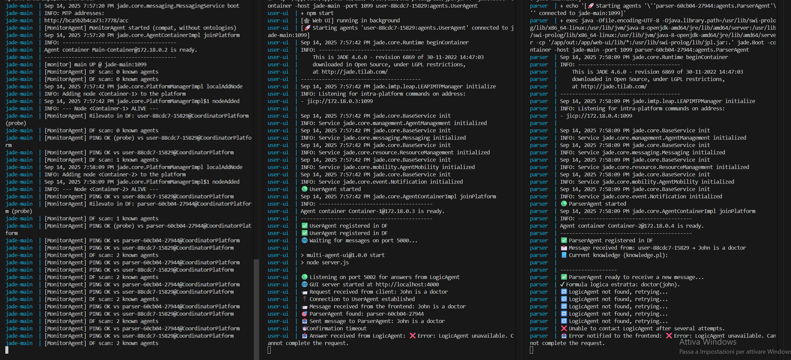
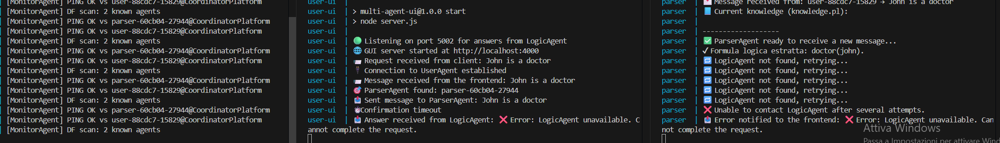
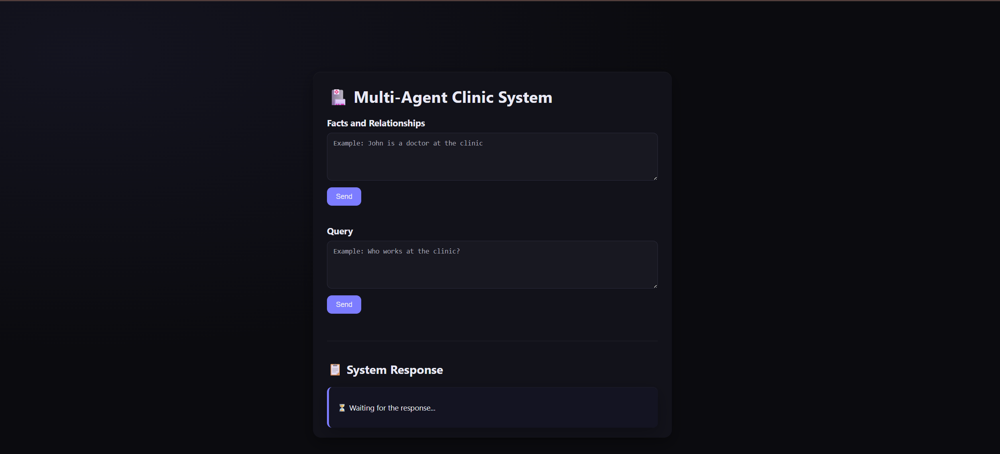
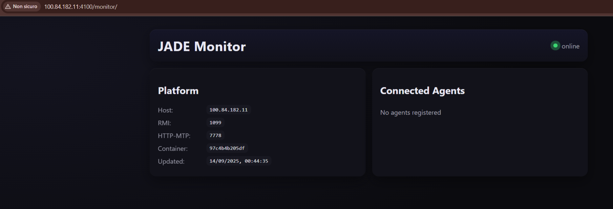
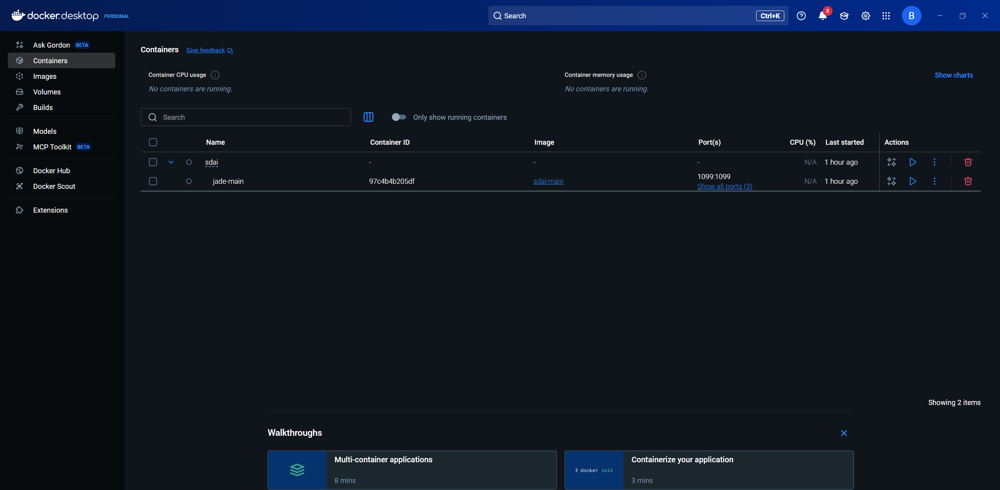
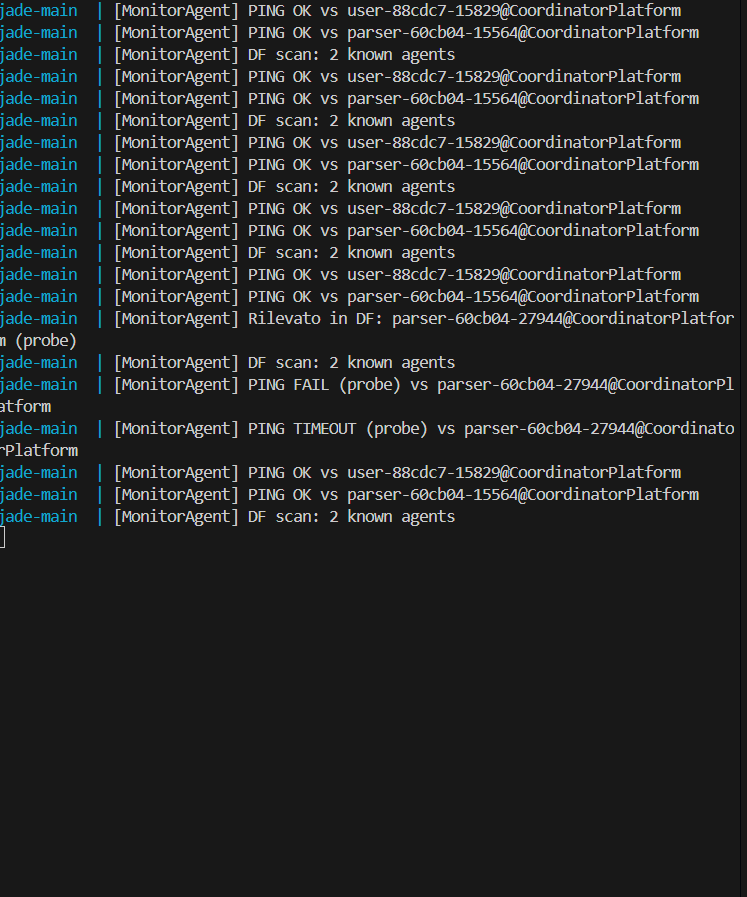
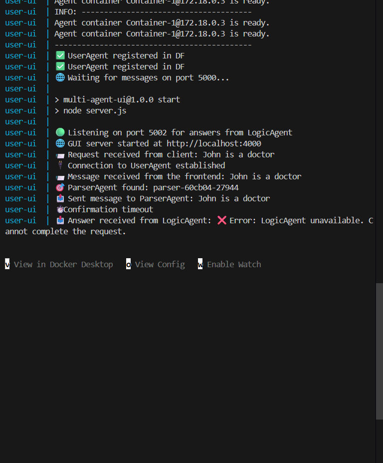
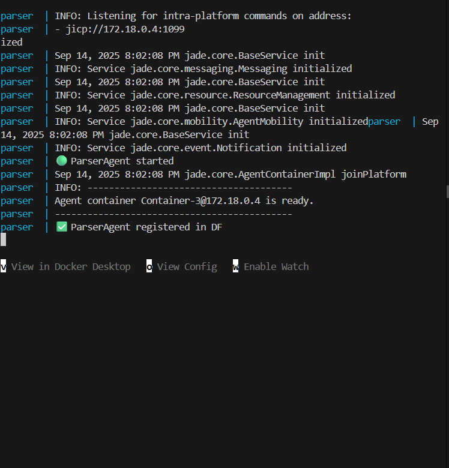

# SDAI — Distributed Agent-Based System

**A multi-agent platform built with JADE that combines NLP (LLM), Prolog logic programming, and distributed containerized deployment.**


---

## Key Features

- **Natural Language to Prolog** — Users type plain English; an LLM (Mistral 7B via OpenRouter) translates it into Prolog facts or queries
- **Distributed Multi-Agent Architecture** — Five JADE agents communicate via ACL messages across Docker containers
- **Live Prolog Reasoning** — LogicAgent uses SWI-Prolog (JPL bridge) to assert facts and evaluate queries at runtime
- **Web GUI** — Express.js frontend with real-time WebSocket updates for chat-style interaction
- **Health Monitoring** — MonitorAgent performs periodic ping/pong health checks on all registered agents
- **Fault Tolerance** — Agents detect unreachable peers with 60s backoff suppression; the system degrades gracefully
- **Fully Containerized** — Single `docker compose` command spins up the entire platform

---

## Architecture

```
┌────────────┐     WebSocket      ┌──────────────┐
│  Browser   │◄──────────────────►│  UserAgent   │
│ (index.html)│    port 4000      │  (port 5000) │
└────────────┘                    └──────┬───────┘
                                         │ ACL
                                         ▼
                                  ┌──────────────┐    LLM API     ┌───────────────┐
                                  │ ParserAgent  │───────────────►│  OpenRouter   │
                                  │              │   (Mistral 7B) │  (cloud)      │
                                  └──────┬───────┘                └───────────────┘
                                         │ ACL
                                         ▼
┌──────────────┐                  ┌──────────────┐
│ QueryAgent   │◄────────────────►│ LogicAgent   │
│ (port 5001)  │   ACL messages   │ (SWI-Prolog) │
└──────────────┘                  └──────┬───────┘
                                         │
                                         ▼
                                  ┌──────────────┐
                                  │ knowledge.pl │
                                  │ (Prolog KB)  │
                                  └──────────────┘

         ┌───────────────┐
         │ MonitorAgent  │ ── periodic health checks on all agents
         └───────────────┘
```

### Agent Roles

| Agent | Role | Service Type |
|-------|------|-------------|
| **UserAgent** | Receives user input from the web GUI via WebSocket and forwards it to the parser | `user` |
| **ParserAgent** | Calls the LLM to translate natural language into Prolog, routes to LogicAgent | `parser` |
| **LogicAgent** | Executes Prolog queries/facts using SWI-Prolog's JPL bridge, returns results | `logic` |
| **QueryAgent** | Accepts direct queries from the frontend socket and routes them to ParserAgent | `query` |
| **MonitorAgent** | Periodically pings all DF-registered agents and reports health status | `monitor` |

---

## Agent Interaction Flow

### Full System Workflow

All agents start up, register with the JADE DF (Directory Facilitator), and process a user request end-to-end:



### Fault Tolerance

When the LogicAgent is unavailable, the ParserAgent detects the failure and suppresses retries for 60 seconds:



---

## Screenshots

### Web Interface

The chat-style GUI where users type natural language facts and queries:



### JADE Monitor Dashboard

Real-time view of agent status and platform health:



### Docker Containers

All services running as isolated containers via Docker Compose:



### Agent Logs

<details>
<summary>MonitorAgent — Health check pings</summary>


</details>

<details>
<summary>UserAgent — Message processing flow</summary>


</details>

<details>
<summary>ParserAgent — Startup and DF registration</summary>


</details>

---

## Use Case: Academic Rule Checking

A user wants to build and query a knowledge base about university rules:

1. **Add a fact** (natural language):
   > "Mario is a student"
   → LLM translates to: `student(mario).`
   → LogicAgent asserts it into Prolog KB

2. **Add a rule** (natural language):
   > "Mario studies at Unical"
   → `studies_at(mario, unical).`

3. **Query** (natural language):
   > "Where does Mario study?"
   → LLM translates to: `?- studies_at(mario, X).`
   → LogicAgent evaluates → `X = unical`
   → LLM humanizes the result: *"Mario studies at Unical."*

---

## Quick Start

### Prerequisites

- [Docker](https://www.docker.com/get-started) and Docker Compose
- An [OpenRouter](https://openrouter.ai/) API key

### 1. Clone the repository

```bash
git clone https://github.com/<your-username>/DABS.git
cd DABS
```

### 2. Set your API key

Open `JADE-bin-4.6.0/jade/web-ui/utils/LLMService.java` and replace the API key on **line 18**:

```java
private static final String API_KEY = "sk-or-v1-YOUR_KEY_HERE"; // Replace with your key
```

### 3. Start the platform

```bash
cd JADE-bin-4.6.0/jade/docker

# Start the main JADE platform (DF + AMS)
docker compose --profile main up -d

# Start all agent containers
docker compose --profile agent up -d
```

### 4. Open the GUI

Navigate to **http://localhost:4000** in your browser.

### 5. Stop everything

```bash
docker compose --profile main --profile agent down
```

---

## Distributed Deployment

Agents can run on **separate machines** by setting environment variables to point to remote hosts.

### Machine A (Main Platform)

```bash
PUBLIC_HOST=<machine-a-ip> docker compose --profile main up -d
```

### Machine B (Agents)

```bash
MAIN_HOST=<machine-a-ip> PUBLIC_HOST=<machine-b-ip> docker compose --profile agent up -d
```

For deployment over **Tailscale VPN**, see the override file:

```bash
docker compose -f docker-compose.yml -f docker-compose.tailscale.yml --profile main --profile agent up -d
```

---

## Environment Variables

| Variable | Default | Description |
|----------|---------|-------------|
| `PUBLIC_HOST` | `jade-main` / service name | Advertised hostname for JADE MTP |
| `MAIN_HOST` | `jade-main` | Address of the main JADE platform (DF/AMS) |
| `PORT` | `1099` | JADE RMI port |
| `HTTP_PORT` | `7778` | JADE HTTP MTP port (main only) |
| `AGENTS` | *(per service)* | Agent class to start, e.g. `user:agents.UserAgent` |
| `UI_AUTOSTART` | `0` | Set to `1` to auto-start the Express.js web server |
| `MAIN_MONITOR_AUTOSTART` | `0` | Set to `1` to auto-start MonitorAgent |
| `QUERY_HOST` | `query` | Hostname of the QueryAgent container |
| `QUERY_PORT` | `5001` | Port for QueryAgent socket |
| `FRONT_HOST` | `user-ui` | Hostname of the frontend container (for result forwarding) |
| `FRONT_PORT` | `5002` | Port for forwarding results to the GUI |

---

## Setup Notes

> **No `.gitignore` exists.** If you fork this repo, create one to exclude:
> `out/`, `node_modules/`, `.env`, `*.class`

> **No `.env` file.** The OpenRouter API key is currently hardcoded in
> [`LLMService.java:18`](JADE-bin-4.6.0/jade/web-ui/utils/LLMService.java#L18).
> Replace it with your own key before building.

> **No separate requirements file.** All dependencies (Java 8, SWI-Prolog, Node.js 18, npm packages)
> are installed inside the Docker image via the [Dockerfile](JADE-bin-4.6.0/jade/docker/Dockerfile).

---

## Project Structure

```
DABS/
├── JADE-bin-4.6.0/jade/
│   ├── docker/
│   │   ├── Dockerfile                 # Container image (Java 8 + SWI-Prolog + Node.js 18)
│   │   ├── docker-compose.yml         # Service definitions (main, agents, user-ui)
│   │   ├── docker-compose.tailscale.yml
│   │   ├── entrypoint.sh              # Container entrypoint (role dispatcher)
│   │   ├── start_main.sh              # Starts JADE main platform
│   │   └── start_agent.sh             # Starts JADE agent container
│   └── web-ui/
│       ├── agents/
│       │   ├── UserAgent.java          # Web GUI ↔ JADE bridge
│       │   ├── ParserAgent.java        # NL → Prolog via LLM
│       │   ├── LogicAgent.java         # Prolog reasoning (JPL)
│       │   └── QueryAgent.java         # Query routing
│       ├── utils/
│       │   ├── LLMService.java         # OpenRouter API client
│       │   └── MonitorAgent.java       # Health monitoring agent
│       ├── kb/
│       │   └── knowledge.pl            # Prolog knowledge base
│       ├── public/
│       │   ├── index.html              # Chat GUI
│       │   ├── monitor.html            # Monitor dashboard
│       │   └── *.css / *.js
│       ├── server.js                   # Express.js web server
│       ├── test/                       # Unit tests
│       └── lib/                        # JARs (JADE, OkHttp, JSON)
└── Report/
    ├── images/                         # Screenshots and workflow diagrams
    └── Report.pdf
```

---

## Tech Stack

| Layer | Technology |
|-------|-----------|
| Agent Platform | JADE 4.6.0 (FIPA-compliant MAS) |
| Logic Engine | SWI-Prolog + JPL (Java-Prolog bridge) |
| LLM | Mistral 7B Instruct via OpenRouter |
| Backend | Java 8 (agents), Node.js 18 (web server) |
| Frontend | HTML/CSS/JS with WebSocket |
| HTTP Client | OkHttp 3.14 |
| Containerization | Docker + Docker Compose |
| Networking | TCP sockets, JADE HTTP MTP, WebSocket |

---

## License

This project was developed as part of a Master's course on Distributed Agent-Based Systems at the University of Calabria (Unical).
